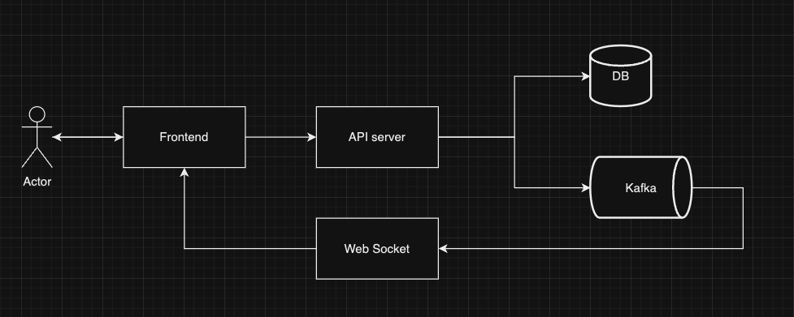

## Sending Message Flow

[Link](https://app.diagrams.net/#G1xkIwGFyjLixf2YvwYbx7equgge-gv3Jr#%7B%22pageId%22%3A%22Z649WcYwynlIUiUDtifl%22%7D)

## Entities

- [User](#user)
- [Group](#group)
- [Message](#message)

### User

| Field      | Type   | Description                       |
| ---------- | ------ | --------------------------------- |
| user_id    | String | Unique identifier for the user    |
| name       | String | Name of the user                  |
| created_at | String | Timestamp of the message creation |
| updated_at | String | Timestamp of the message update   |
| deleted_at | String | Timestamp of the message deletion |

### Group

| Field      | Type           | Description                       |
| ---------- | -------------- | --------------------------------- |
| group_id   | String         | Unique identifier for the group   |
| name       | String         | Name of the group                 |
| user_ids   | List of String | List of user ids in the group     |
| created_at | String         | Timestamp of the message creation |
| updated_at | String         | Timestamp of the message update   |
| deleted_at | String         | Timestamp of the message deletion |

### Message

| Field       | Type   | Description                       |
| ----------- | ------ | --------------------------------- |
| message_id  | String | Unique identifier for the message |
| sender_id   | String | User id of the sender             |
| receiver_id | String | User id of the receiver           |
| group_id    | String | Group id of the receiver          |
| content     | String | Content of the message            |
| created_at  | String | Timestamp of the message creation |
| updated_at  | String | Timestamp of the message update   |
| deleted_at  | String | Timestamp of the message deletion |

### ActiveUser

| Field   | Type   | Description                    |
| ------- | ------ | ------------------------------ |
| user_id | String | Unique identifier for the user |
